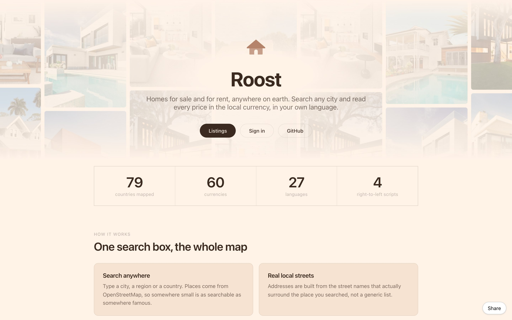
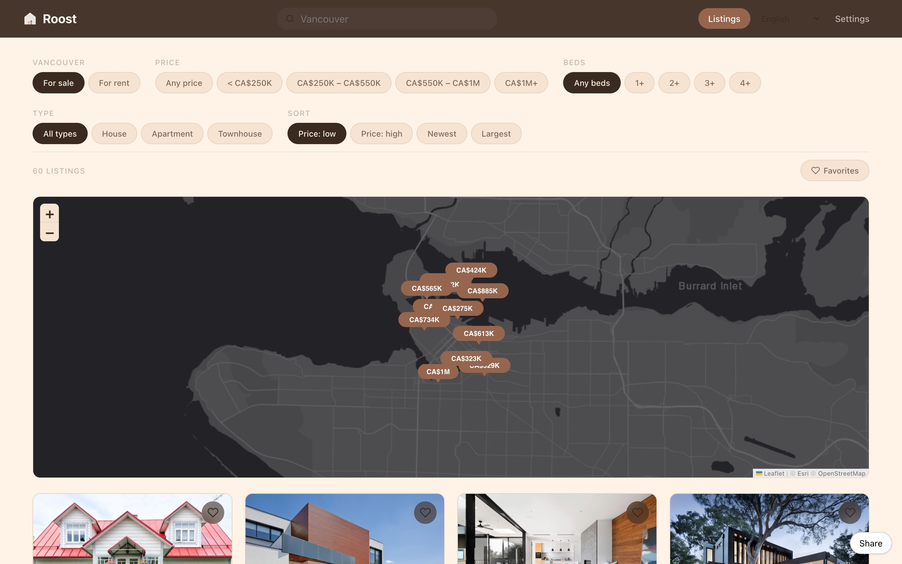
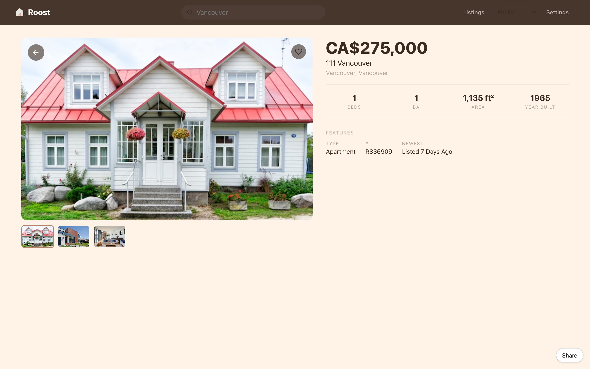

# Roost


**Live:** https://roost.heyitsmejosh.com

Browse homes anywhere on earth.

Type a city. Any city. Flip between for sale and for rent. Every price in the local
currency, every label in the local language.



| Browse | Listing |
|---|---|
|  |  |

## Features

- Find any place on earth through Nominatim. No API key
- Real street names from OpenStreetMap for wherever you're looking
- Currency, price levels, rental yields and ft² or m², per country
- Sale and rent, with price filters cut to the local market's own scale
- 25 languages, right-to-left included, picked from your browser
- A map with price pills, filters and favourites
- Supabase Auth: email and password, forgot password, sessions that stick

## Run

```bash
cp .env.example .env   # Supabase URL + anon key; without them sign-in is disabled
npm install && npm run dev
npm run build
node src/data/listings.test.mjs
```

## Data

Listings are generated per place and seeded from its coordinates, so a city always
shows the same homes. The shape matches an MLS/IDX response. Swapping in a real
feed is one function in `src/data/listings.js`.

## Source

[github.com/nulljosh/roost](https://github.com/nulljosh/roost)

## License

MIT 2026 Joshua Trommel

[Technical whitepaper](WHITEPAPER.md)

## API and agent tools

An agent can drive this app. [`docs/API.md`](docs/API.md) lists the HTTP surface, where there
is one, and the WebMCP tools registered on `document.modelContext`. Tools come in three kinds:
read-only, writes you can undo, and the few that ask a human first.

## Architecture


